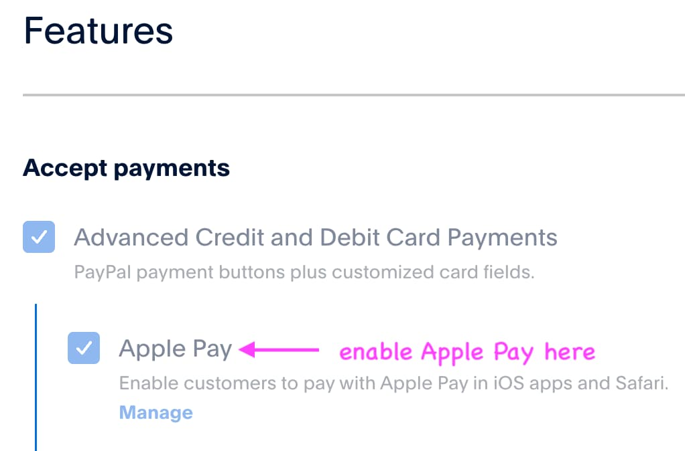
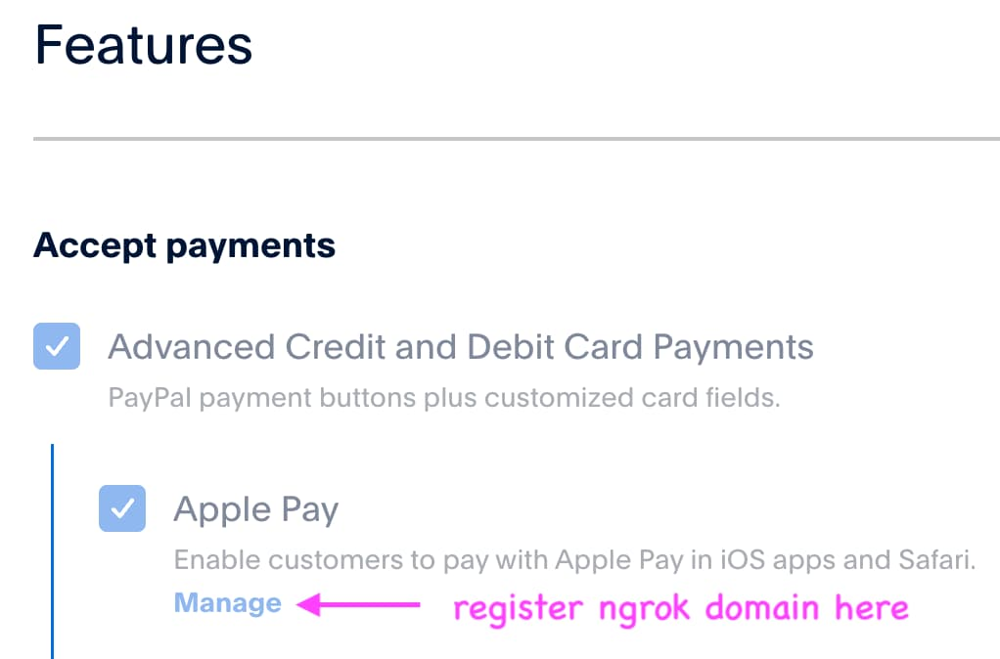
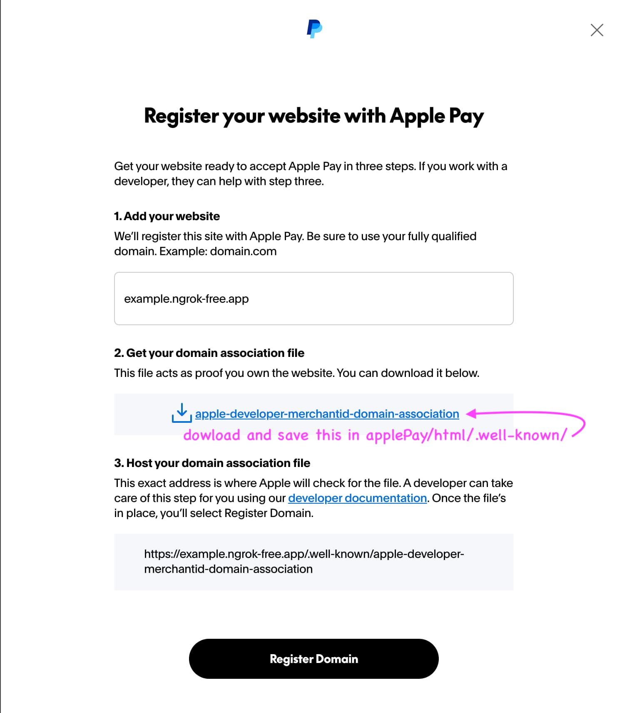

# Apple Pay HTML Sample Integration

This demo showcases how to integrate Apple Pay as a payment method using PayPal's v6 Web SDK. The integration allows merchants to offer Apple Pay as a seamless payment option for their customers on Safari browsers and iOS devices.

## 🏗️ Architecture Overview

This sample demonstrates a complete Apple Pay integration flow:

1. Initialize PayPal Web SDK with the Apple Pay component
2. Configure Apple Pay payment request
3. Handle Apple Pay merchant validation and payment authorization

## 📋 Prerequisites

Before running this demo, you'll need to set up accounts and configure your development environment.

### 1. PayPal Developer Account Setup

1. **PayPal Developer Account**
   - Visit [developer.paypal.com](https://developer.paypal.com)
   - Sign up for a developer account or log in with existing credentials
   - Navigate to the **Apps & Credentials** section in your dashboard

2. **Create a PayPal Application** (or configure the default application)
   - Click **Create App**
   - Name your app
   - Select **Merchant** under **Type**
   - Choose the **Sandbox** account for testing
   - Click **Create App** at the bottom of the modal
   - Enable **Features** -> **Accept payments** -> **Apple Pay** (be sure to click **Save Changes** below)
   - Note your **Client ID** and **Secret key** under **API credentials** for later configuration of the `.env` file

   

### 2. Apple Developer Account Setup

You are required to sign up for the Apple Developer Program in order to process payments. If you opt out of this step, you will be able to click the button and open the payment handler, but will be unable to process payments. Please see [these instructions](https://developer.apple.com/help/account/membership/program-enrollment/) for signing up.

1. **Create a Sandbox Tester Account**
   - After receiving approval from Apple for the Apple Developer Program, please follow the "Create a Sandbox Tester Account" instructions located [here](https://developer.apple.com/apple-pay/sandbox-testing/)
   - Do not enable two-factor authentication
   - Sign into the sandbox iCloud account on your Apple device, and be sure to verify your email address
   - Add a test credit card number to your Apple Pay Wallet from the sandbox testing link above, located under "Test Cards for Apps and the Web"

### 3. ngrok Account Setup

Since Apple Pay requires HTTPS to function, you'll need to create a secure tunnel to your local development environment using ngrok.

1. **Create a free ngrok account:**
   - Visit [ngrok.com](https://ngrok.com) and sign up for a free account
   - Verify your email address and optionally set up 2FA
   - Navigate to **Getting Started** → **Your Authtoken**
   - Note your authtoken for later use

2. **Why ngrok is needed:**
   - Apple Pay only works over HTTPS connections
   - ngrok creates a secure tunnel from a public HTTPS URL to your local development server
   - This allows you to test Apple Pay integration locally without deploying to a production server

## 🚀 Running the Demo

### `ngrok` Setup

1. **Install ngrok globally:**

   ```bash
   npm install -g ngrok
   ```

2. **Authenticate ngrok:**
   - Copy your authtoken and run:

   ```bash
   ngrok config add-authtoken YOUR_AUTHTOKEN_HERE
   ```

3. **Start ngrok tunnel:**

   ```bash
   ngrok http 3000
   ```

4. **Note your HTTPS URL:**
   - ngrok will display output similar to:

   ```
   Forwarding  https://example.ngrok-free.app -> http://localhost:3000
   ```

   - Copy the domain (e.g. `example.ngrok-free.app`)
   - This is the domain that needs to be added to the vite server config and registered for Apple Pay in your PayPal developer account

5. **Update Vite configuration:**
   - Open `applePay/html/vite.config.js`
   - Add your ngrok domain to the allowed hosts:

   ```javascript
   export default defineConfig({
     server: {
       allowedHosts: ["example.ngrok-free.app"],
     },
   });
   ```

6. **Register ngrok domain with PayPal:**
   - In your PayPal developer dashboard, navigate to your app's Apple Pay settings under **Features** -> **Accept payments** -> **Apple Pay** -> **Manage**
   - Add your ngrok domain (e.g. `example.ngrok-free.app`) to the approved domains list
   - Before clicking **Register Domain**, download and save the domain association file to `applePay/html/.well-known/apple-developer-merchantid-domain-association`




**Important Notes:**

- Free ngrok accounts get a new random domain each time you restart ngrok
- Each new domain needs to be registered for Apple Pay with PayPal
- The tunnel will stay active as long as the ngrok process is running
- Always use the HTTPS URL provided by ngrok for Apple Pay testing

### Server Setup

1. **Navigate to the server directory:**

   ```bash
   cd server/node
   ```

2. **Install dependencies:**

   ```bash
   npm install
   ```

3. **Configure environment variables:**
   Create a `.env` file in the root directory:

   ```env
   PAYPAL_SANDBOX_CLIENT_ID=your_paypal_sandbox_client_id
   PAYPAL_SANDBOX_CLIENT_SECRET=your_paypal_sandbox_client_secret
   ```

4. **Start the server:**
   ```bash
   npm start
   ```
   The server will run on `https://localhost:8080`

### Client Setup

1. **Navigate to the Apple Pay demo directory:**

   ```bash
   cd client/components/applePay/html
   ```

2. **Install dependencies:**

   ```bash
   npm install
   ```

3. **Start the development server:**
   ```bash
   npm start
   ```
   The demo will be available at `http://localhost:3000`

## 🧪 Testing the Integration

1. **Open Safari Browser**
   - Navigate to your ngrok https domain
   - click Visit Site

2. **Initiate Apple Pay**
   - Click the Apple Pay button
   - The Apple Pay sheet will appear with your test payment method

3. **Complete Payment**
   - Select the test credit card you added to your sandbox iCloud wallet
   - Authenticate with Touch ID, Face ID, or device passcode
   - The payment should process successfully

4. **Verify Results**
   - Check the browser console logs for order capture details

## 🔧 Code Structure

### Key Files

- **`src/index.html`**: Main HTML page with Apple Pay button container
- **`src/app.js`**: Core integration logic including:
  - PayPal SDK initialization
  - Apple Pay session management
  - Order creation and capture
- **`package.json`**: Dependencies and build scripts
- **`vite.config.js`**: Vite development server configuration

### Integration Flow

1. **SDK Initialization**: Load PayPal Web SDK with Apple Pay components
2. **Button Setup**: Create Apple Pay button with proper styling
3. **Payment Request**: Configure payment details
4. **Session Management**: Handle Apple Pay session events:
   - `onvalidatemerchant`: Validate merchant and domain
   - `onpaymentmethodselected`: Update payment method
   - `onpaymentauthorized`: Process authorized payment
   - `oncancel`: Handle payment cancellation

## 🔒 Security Considerations

- **HTTPS Required**: Apple Pay only works over HTTPS
- **Domain Verification**: Ensure your domain is properly registered in your vite server config and for Apple Pay in your PayPal developer account
- **Domain Association File**: Keep your Apple Pay domain association file up to date
- **Client Token Security**: Use browser-safe client tokens for frontend integration

## 🐛 Troubleshooting

### Common Issues

1. **Apple Pay Button Not Appearing**
   - Verify you're using Safari browser
   - Verify Apple Pay is enabled in your PayPal application
   - Ensure Apple Pay is enabled in Safari **Settings** -> **Advanced** -> `Allow websites to check for Apple Pay and Apple Card`
   - Ensure your `ngrok` domain is added to `vite.config.js` -> `defineConfig` -> `server` -> `allowedHosts`

2. **Merchant Validation Fails**
   - Verify your domain is registered with Apple Pay at [developer.paypal.com](https://developer.paypal.com)
   - Check that your domain association file is accessible at `/.well-known/apple-developer-merchantid-domain-association`

3. **Payment Authorization Fails**
   - Check that you're signed into your sandbox iCloud account
   - Ensure you're using an [Apple test credit card](https://developer.apple.com/apple-pay/sandbox-testing/)
